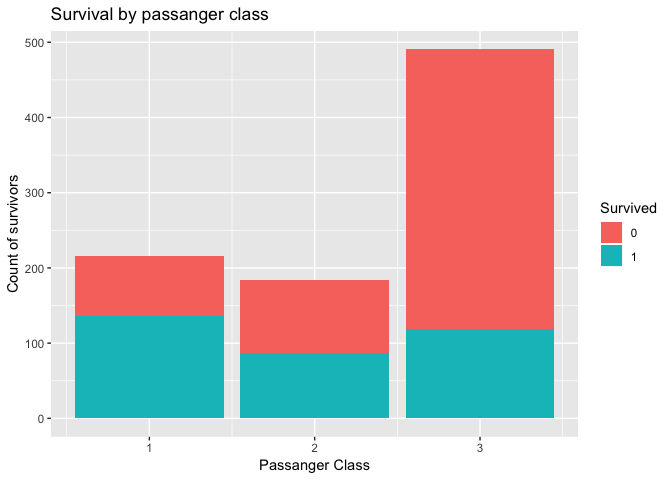
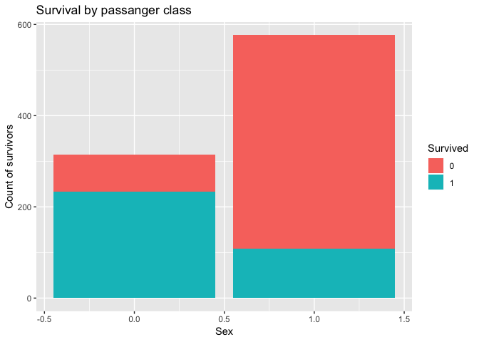

Titanic - Exploratory Data Analysis
================

Introduction
============

Display exploratory data analysis of the Titanic dataset here. The purpose is to understand the data before moving into the modelling phase of the project.

Note that the data that we are working with is the data that we have cleaned up previously. I.e. we need to run the code in analysis.R before coming to this part.

Analysis
========

Survivability by passanger class
--------------------------------

``` r
library(ggplot2)
ggplot(train, aes(x = Pclass, fill = as.factor(Survived))) +
  geom_bar() +
  labs(x = "Passanger Class", y = "Count of survivors", fill = "Survived",
       title = "Survival by passanger class")
```

 From a simple eyeballing test, there doesn't seem to be much discrepancy between the survivability of passangers in classes 1 or 2. However, there are significantly less survivors from class 3.

Survivability by sex
--------------------

``` r
# male == 1, female == 0
# should change this, but ceebs
ggplot(train, aes(x = Sex, fill = as.factor(Survived))) +
  geom_bar() +
  labs(x = "Sex", y = "Count of survivors", fill = "Survived",
       title = "Survival by passanger class")
```


